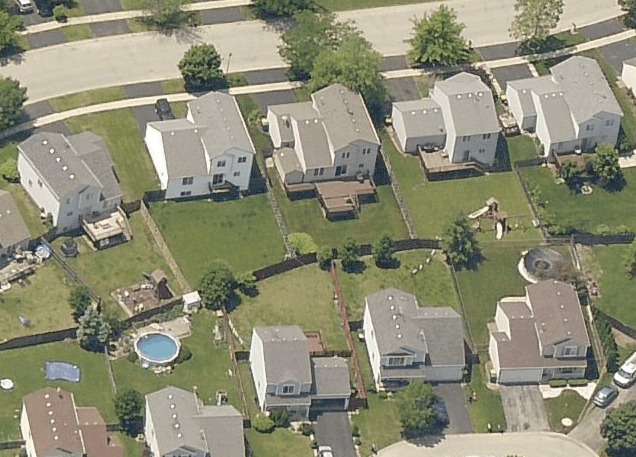

=======
Example
=======

A simple tool that uses the height measurement tool to allow a user to measure height on the first oblique image in a dataset

This app uses the following dependecies:

* EVTech
* OpenCV

Demo
----

Source
------

.. literalinclude:: ../example/main.py